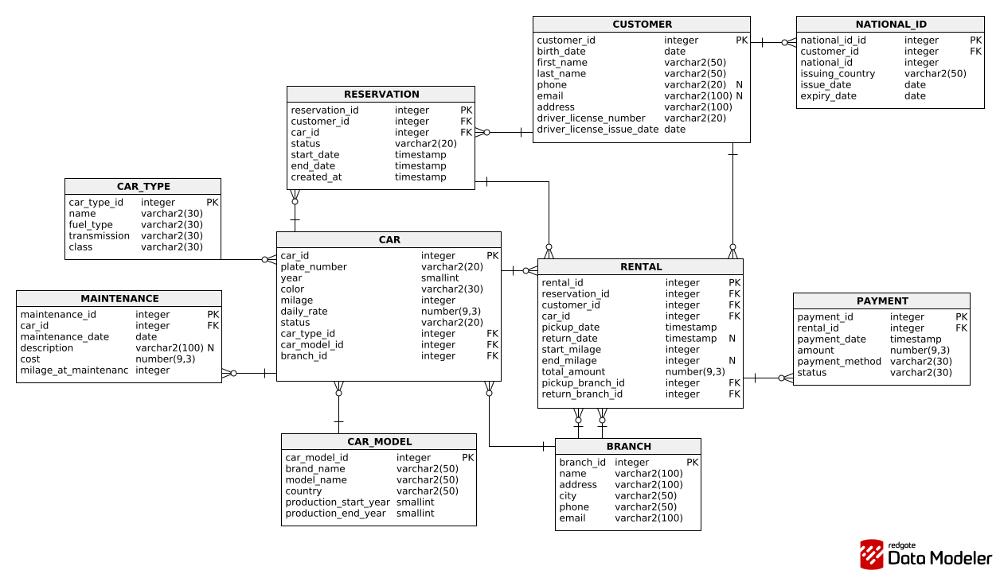

# Car Rental Database Project

A **Car Rental Management System** database implemented for both **Oracle (PL/SQL)** and **Microsoft SQL Server (T-SQL)**.
The project includes schema design (DDL), seed data (DML), stored procedures, triggers, test scripts, and an ER diagram.

## Tech Stack
- Oracle: **PL/SQL**
- Microsoft SQL Server: **T-SQL**

## Core Entities
CUSTOMER, NATIONAL_ID, BRANCH, CAR_MODEL, CAR_TYPE, CAR, RESERVATION, RENTAL, PAYMENT, MAINTENANCE

## Implemented Business Logic
**Stored Procedures**
- Oracle: `add_payment`, `close_rental`
- MSSQL: `usp_add_payment`, `usp_close_rental`

**Triggers**
- `trg_payment_no_overpay` — prevents overpayment (sum of payments cannot exceed rental total)
- `trg_rental_car_status` — maintains car status during rental lifecycle

## Files
- `01_ddl_oracle.sql` / `01_ddl_mssql.sql` — tables, constraints, indexes
- `02_dml_oracle.sql` / `02_dml_mssql.sql` — seed data
- `03_proc_oracle.sql` / `03_proc_mssql.sql` — stored procedures
- `04_trg_oracle.sql` / `04_trg_mssql.sql` — triggers
- `05_test_oracle.sql` / `05_test_mssql.sql` — example calls / tests
- `diagram.png` — ER diagram
- `database_requirements.txt` — requirements & assumptions

## How to Run

### Oracle (PL/SQL)
Run scripts in order:
1. `01_ddl_oracle.sql`
2. `02_dml_oracle.sql`
3. `03_proc_oracle.sql`
4. `04_trg_oracle.sql`
5. `05_test_oracle.sql`

> Note: Oracle scripts are created in the **current schema** (no schema prefix is used).

### Microsoft SQL Server (T-SQL)
Run scripts in order:
1. `01_ddl_mssql.sql`
2. `02_dml_mssql.sql`
3. `03_proc_mssql.sql`
4. `04_trg_mssql.sql`
5. `05_test_mssql.sql`

> Note: MSSQL scripts use the schema **`s32736`** and also include `USE [2019SBD];`.
If needed, adjust the database name and/or schema.

## ER Diagram
